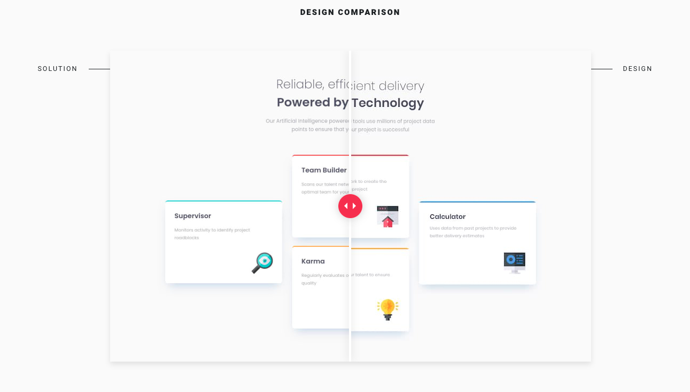

# [Frontend Mentor](frontendmentor.io/) - Four card feature section

## The challenge
The challenge is to build out this card feature section and get it looking as close to the design as possible.

Users should be able to:

- View the optimal layout for the site depending on their device's screen size

## Link

- Live Site URL: [https://dinahbrito.github.io/four-card-feature-section/](https://dinahbrito.github.io/four-card-feature-section/)

## Technologies used

- Semantic HTML5 markup
- Flexbox
- CSS Grid